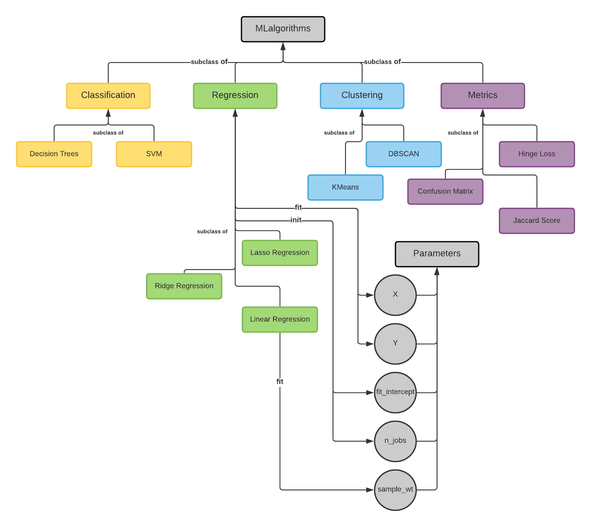
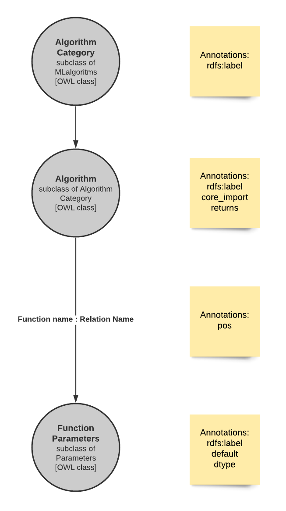

## The big picture

The image shows a small version of the ontology created as part of the project. Having the algorithms listed as a tree, helps in maintaining the hierarchy. 
The hierarchy helps in directly transforming the OWL classes into python adapter files in an object oriented way.
This Object oriented approach helps in not redefining functions like fit and predict which are common to many algorithms. It also helps in not redefining the parameters shared across different algorithms.

## Ontology structure

The generic structure of the ontology with detailed description of class, relations and annotation properties.

