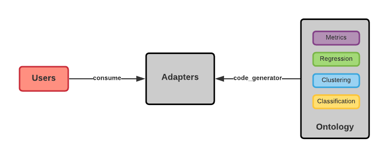
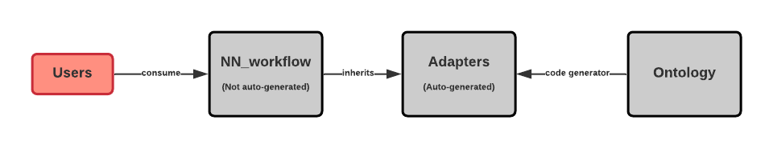

.. -*- mode: rst -*-

|PythonVersion|_ |test|_ |total|_ |last|_ |lines|_ |size|_ 

.. |PythonVersion| image:: https://img.shields.io/badge/python-3.6%20%7C%203.7%20%7C%203.8-blue
.. _PythonVersion: https://img.shields.io/badge/python-3.6%20%7C%203.7%20%7C%203.8-blue

.. |last| image:: https://img.shields.io/github/last-commit/2kunal6/MLadapters
.. _last: https://img.shields.io/github/last-commit/2kunal6/MLadapters

.. |size| image:: https://img.shields.io/github/repo-size/2kunal6/MLadapters?color=lightgrey
.. _size: https://img.shields.io/github/repo-size/2kunal6/MLadapters?color=lightgrey

.. |lines| image:: https://img.shields.io/tokei/lines/github/2kunal6/MLadapters?color=lightgrey
.. _lines: https://img.shields.io/tokei/lines/github/2kunal6/MLadapters?color=lightgrey

.. |test| image:: https://img.shields.io/badge/Testing-Done-brightgreen
.. _test: https://img.shields.io/badge/Testing-Done-brightgreen

.. |total| image:: https://img.shields.io/badge/Number%20of%20algorithms-47-red
.. _total: https://img.shields.io/badge/Number%20of%20algorithms-47-red

.. |PythonMinVersion| replace:: 3.6
.. |owlready2MinVersion| replace:: 0.25
.. |Scikit-learnMinVersion| replace:: 0.24.1
.. |PytorchMinVersion| replace:: 1.7.0

**MLadapters** is a Python wrapper/adapter for algorithms defined in Scikit and Pytorch. The wrapper/adapter code is auto generated based on classes defined in ontology.

The modified flow diagram shows the system specific to Pytorch adapters. 

Dependencies
----------------

This project requires:

- owlready2 (== |owlready2MinVersion|)
- python (>= |PythonMinVersion|)
- pytorch (>= |PytorchMinVersion|)
- scikit-learn (>= |Scikit-learnMinVersion|)

User installation
----------------

1. Install python3
2. Install pip
3. Install pipenv
4. Go to the root of the project where the Pipfile exists
5. python3 -m pipenv install --ignore-pipfile
6. python3 -m pipenv shell

Documentation
----------------
.. _onto_doc: https://github.com/s6fikass/semanticweblab2020-2021/blob/master/Code/Implement%20and%20design%20a%20machine%20learning%20hierarchy%20wrapper%20for%20SimpleML/docs/Ontology%20Structure.md
.. _tutorial: https://github.com/s6fikass/semanticweblab2020-2021/blob/master/Code/Implement%20and%20design%20a%20machine%20learning%20hierarchy%20wrapper%20for%20SimpleML/docs/API.md

- Ontology documentation is available `here <onto_doc_>`_

- API documentation is available `here <tutorial_>`_
  
Quickstart
----------------

* Wrappers can be consumed by creating an object of the wrapper class. In the below example, the object created is an adapter of the model: LinearRegression. **Note: Please don't rely on parameter positions, as the code is autogenerated. Instead always pass the arguments when creating an object of the Adapter class, like below.**

  >>> from MLalgorithms.Regression._LinearRegression import LinearRegression
  >>> adapterObj = LinearRegression(normalize=True)

* The wrapper class has functionalities like fit and predict, it can be invoked by the object.

  >>> adapterObj.predict(np.array([[3, 5]]))
  
* To learn more about the usage of the project, please refer the example scripts present under the example and test directories. **Note: Detailed step by step workflow is mentioned in the example scipts to make it easier for understanding and testing.**
::

      python3 tester/lasso_regression_tester.py
      python3 examples/onto_based_neural_network_example.py

* Code generator can be run to automatically generate wrapper classes from ontology.
::

      python3 code_generator.py
**Please note, as part of using our system, we don't expect you to run the code generator. We already provide the auto-generated adapters.
Advanced users of the project can also add new algorithms to the ontology and run the code generator to create adapters for the new algorithms from the ontology. Kindly contact the contributors if you face issues when experimenting with code generation.**

**We expect the users to have the exact versions of the libraries as specified in the dependencies. Importantly, only 0.25 version of Owlready2 must be installed when experimenting with code generator. Versions above and below this would throw error.**

Implementation stats
----------------
- Total number of algorithms: 47
- Scikit-learn algorithms: 46
- Clustering algorithms: 9
- Regression algorithms: 22
- Classification algorithms: 10
- Metrics algorithms: 5
- Pytorch generic class: 1

Project structure
----------------
 ::

    project
    ├── code_generator.py       # Code generator script
    ├── mlalgorithms.owl        # Ontology OWL file
    ├── examples                # Examples
    │   ├── decision_tree_classifier_example.py
    │   ├── neural_network_example.py
    │   ├── onto_based_neural_network_example.py
    │   └── ...
    ├── test                    # Test scipts to validate autogenerated adapters
    │   ├── linear_regression_tester.py
    │   └── ...
    ├── util                     
    │   ├── file_content_creator.py          
    │   ├── file_util.py
    │   └── position_parser.py    
    ├── workflow          
    │   ├── NN_workflow.py      # Pytorch workflow class
    ├── MLalgorithms            # Base directory for autogenerated adapaters.
    │   ├── Metrics          
    │   |   ├── _confusion_matrix.py          
    │   |   ├── _hinge_loss.py          
    │   |   ├── _jaccard_score.py          
    │   ├── Regression          
    │   |   ├── _LinearRegression.py
    │   |   ├── _RidgeRegression.py
    │   |   └── ...          
    │   ├── Classification
    │   ├── ...          
    │   ├── _Metrics.py          
    │   ├── _Classification.py
    │   ├── _Regression.py
    │   └── _MLalgorithms.py
    ├── Pipfile          
    ├── Readme.rst
    └── ...
    

Deliverables
----------------
- [✔] Ontology creation: Defining hierarchy and rules.
- [✔] Defining various algorithms from Scikit and Pytorch in ontology.
- [✔] Python script to auto-generate classes and functions from ontology.
- [✔] Python scripts to auto-generate adapters. 
- [✔] Documenting the Adapters with code and examples.
- [✔] Documenting the Ontology.
- [✔] Test functions for every adapter generated.
- [ ] Using ontology to perform fault detection.

What's Left
----------------
- Using ontology to perform fault detection.

Reference
----------------

- scikit API: https://scikit-learn.org/stable/modules/classes.html
- owlready2 API: https://owlready2.readthedocs.io/en/latest/
- pytorch API: https://pytorch.org/docs/stable/index.html
- Mex Vocabulary: https://github.com/mexplatform/mex-vocabulary

Contributors
----------------

- Firas (Mentor)
- Varun Shankar S (Student) (s6vasubr@uni-bonn.de)
- Priya Priya (Student)
- Aditya Vijay Jogalekar (Student)
- Kunal (Student)

